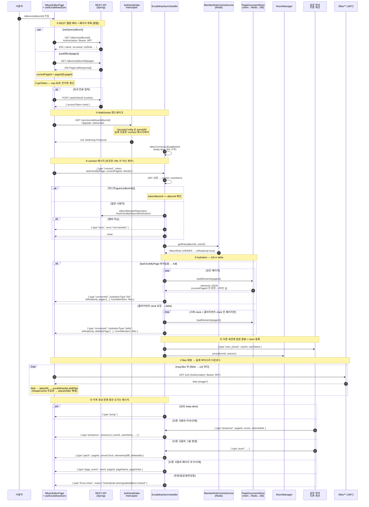
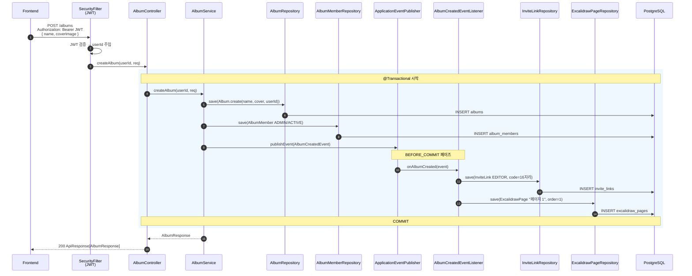
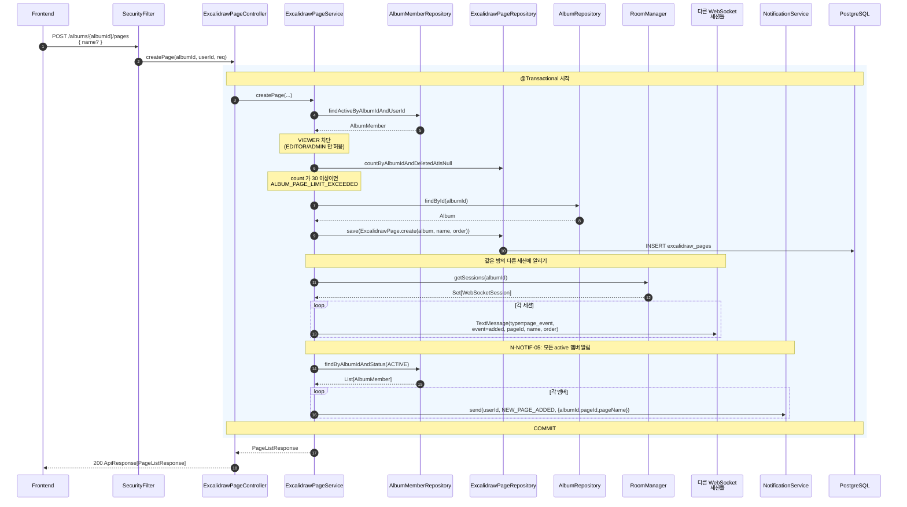
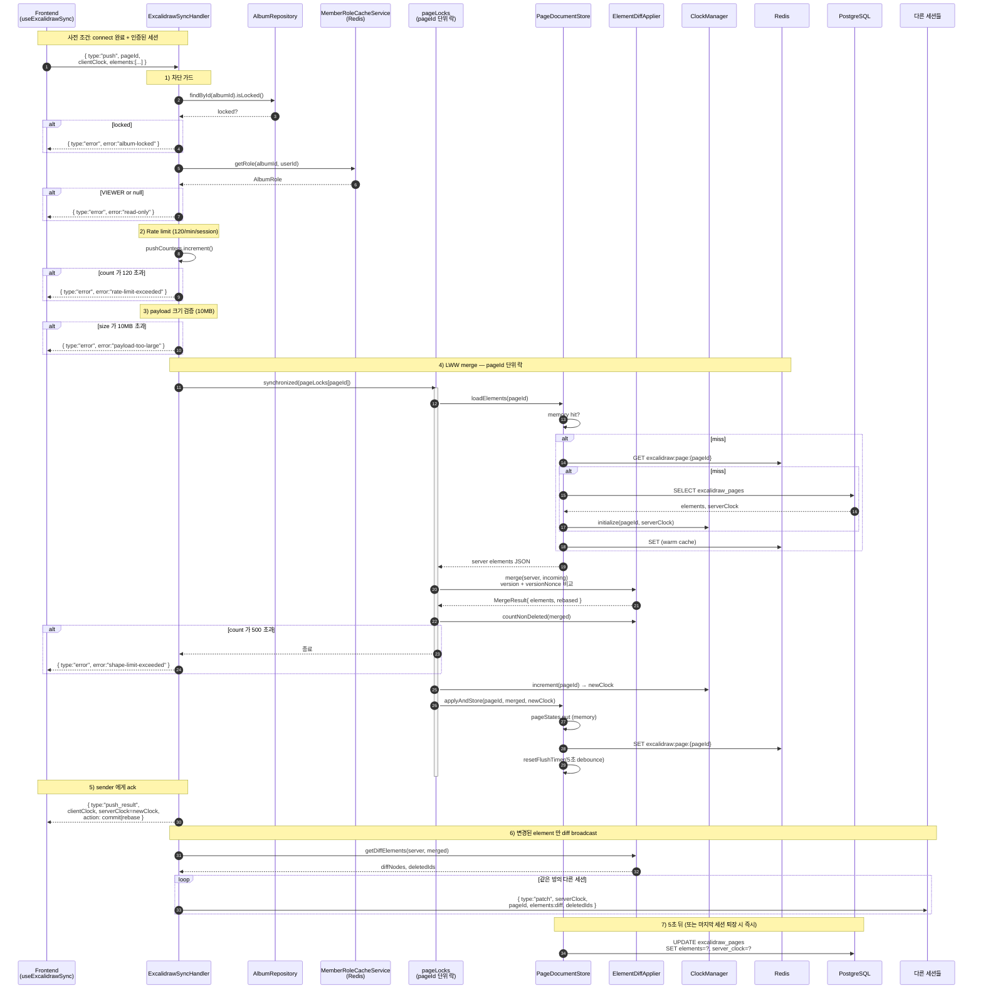

# API 시퀀스 다이어그램

앨범 생성 → 페이지 생성 → 객체(element) 추가까지의 주요 백엔드 흐름.

대상 API
- 앨범 에디터 진입 — REST 2번 + WebSocket 핸드셰이크/hydration
- `POST /albums` — 앨범 생성
- `POST /albums/{albumId}/pages` — 페이지 생성
- WebSocket `/sync/excalidraw/{albumId}` `push` 메시지 — 캔버스 객체 추가/수정

---

## 0. 앨범 에디터 진입 (`/albums/{albumId}` 페이지 로드)

`AlbumEditorPage` 가 마운트되면 REST 2번 + WebSocket 1개가 거의 동시에 시작된다.
WS hydration 은 클라이언트가 들고 있던 `lastClockByPage` 유무에 따라 **full** (최초 진입) 또는 **delta** (재진입/새로고침) 로 분기된다.



핵심 포인트
- **REST 2개 + WS 1개가 동시에 출발**한다. `currentPageId` 가 REST 응답으로 결정되기 전에 WS `connect` 가 먼저 갈 수 있어서, 서버는 `currentPageId` 가 null/빈값/"null" 이면 첫 페이지로 fallback (`ExcalidrawSyncHandler.java:239`).
- **토큰은 URL query 가 아니라 connect 메시지 본문**으로 전달 — nginx 로그/프록시 노출 방지.
- **hydration 분기**:
  - 최초 진입 → `full`: 모든 페이지의 메타를 보내되 본문(elements) 은 `currentPageId` 만, 나머지는 빈 배열. 전환 시 REST `/pages/{pageId}/elements` 로 재요청한다.
  - 새로고침/재연결 → `delta`: 서버 clock > 클라이언트 clock 인 페이지만 elements 전송. 대역폭 절감.
- **`isReadonly`** = VIEWER 거나 role 캐시 미스 — 클라이언트는 이걸로 캔버스를 readonly 로 잠근다.
- **`roomMembers`** = 지금 방에 접속해 있는 사용자 목록. 초기 우상단 participant pill 표시에 사용.
- **`files`** = `(fileId → url)` 매핑만. 실제 이미지는 클라이언트가 JWT 헤더 달고 `GET /files/**` 로 따로 받는다 (B-SEC-05).
- **room join 순서**: 인증 → `connected` 응답 → `user_joined` broadcast → `RoomManager.join`. join 을 마지막에 두는 이유는 인증 안 된 세션이 broadcast 를 받지 못하게 하기 위함.
- **재연결**: WS `onclose` 시 exponential backoff (3s → 6s → 12s → … 최대 60s). 재연결 시 `lastClockByPage` 를 들고 가므로 → delta hydration.

---

## 1. 앨범 추가 (`POST /albums`)

생성 트랜잭션 안에서 `AlbumCreatedEvent` 를 publish 하고, `BEFORE_COMMIT` 페이즈의 리스너가 같은 트랜잭션에서 초대 링크와 기본 페이지 1개를 함께 생성한다. (커밋 전에 실패하면 앨범 자체도 롤백)



핵심 포인트
- ADMIN 멤버 등록은 `AlbumService` 가, 초대 링크 + 기본 페이지는 리스너가 책임 분리.
- `BEFORE_COMMIT` 으로 같은 트랜잭션 안에 묶여 있어, 둘 중 하나라도 실패하면 앨범 자체가 롤백된다.
- 응답 시점에는 이미 기본 페이지 1개와 초대 링크 1개가 DB 에 존재.

---

## 2. 페이지 추가 (`POST /albums/{albumId}/pages`)

권한 검증 → 최대 30개 제한 → DB 저장 → 같은 방의 다른 세션에 `page_event(added)` 브로드캐스트 → 모든 active 멤버에게 SSE 알림 발송.



핵심 포인트
- `requireEditor` — VIEWER 는 페이지 생성 불가.
- 페이지 개수 30개 상한.
- WS 브로드캐스트(`page_event`) 와 SSE 알림(`NEW_PAGE_ADDED`) 이 별개 경로로 함께 발송된다.

---

## 3. 객체(Element) 추가 — WebSocket `push`

REST 가 아니라 `/sync/excalidraw/{albumId}` WebSocket 으로 들어온다.
도형 1개를 추가하면 변경된 elements 배열이 `push` 메시지로 올라오고, 서버는 LWW(Last-Write-Wins) merge → 메모리/Redis 즉시 갱신 → DB 는 5초 debounce 로 write-behind.



핵심 포인트
- **LWW merge**: 각 element 의 `version` + `versionNonce` 로 server 측이 더 신선하면 클라이언트 변경을 버린다 (`rebase`). 그래서 sender 에게 `action: commit|rebase` 가 같이 회신됨.
- **pageId 단위 락**: `load → merge → store` 의 원자성 보장. 동시 push 가 들어와도 같은 페이지면 직렬화된다.
- **Write-Behind**:
  - memory(`ConcurrentHashMap`) + Redis 는 매 push 마다 즉시 갱신
  - DB 는 마지막 push 후 5초 idle 시 한 번만 UPDATE → 폭주하는 push 에 대해 DB write 폭증 방지
  - 방 마지막 세션 퇴장 시 / 앱 종료(`@PreDestroy`) 시 즉시 flush.
- **broadcast 는 diff 만**: 500개 도형 중 1개 변경 → 1개만 전송. 클라이언트는 `reconcileElements` 로 병합.

---

## 흐름 요약 (한 줄)

```
에디터 진입: REST GET album + GET pages (병렬) → WS open → connect(token,clocks) → connected(full|delta) + user_joined broadcast → files 바이너리는 GET /files/**
앨범 생성  : REST → @Transactional + BEFORE_COMMIT 리스너로 (Album + ADMIN + InviteLink + 기본 Page) 원자 생성
페이지 추가: REST → 권한/상한 검증 → DB INSERT → 같은 방에 page_event 브로드캐스트 + 멤버에게 SSE 알림
객체 추가  : WS push → 가드(잠금/권한/rate/size) → pageId 락 안에서 LWW merge → memory+Redis 즉시 / DB 5s debounce → push_result + diff patch
```
