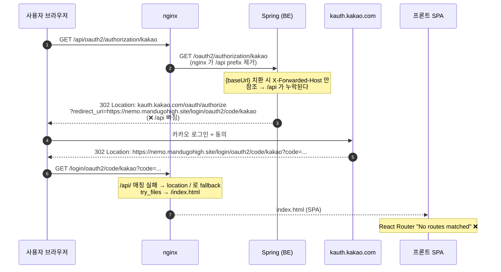
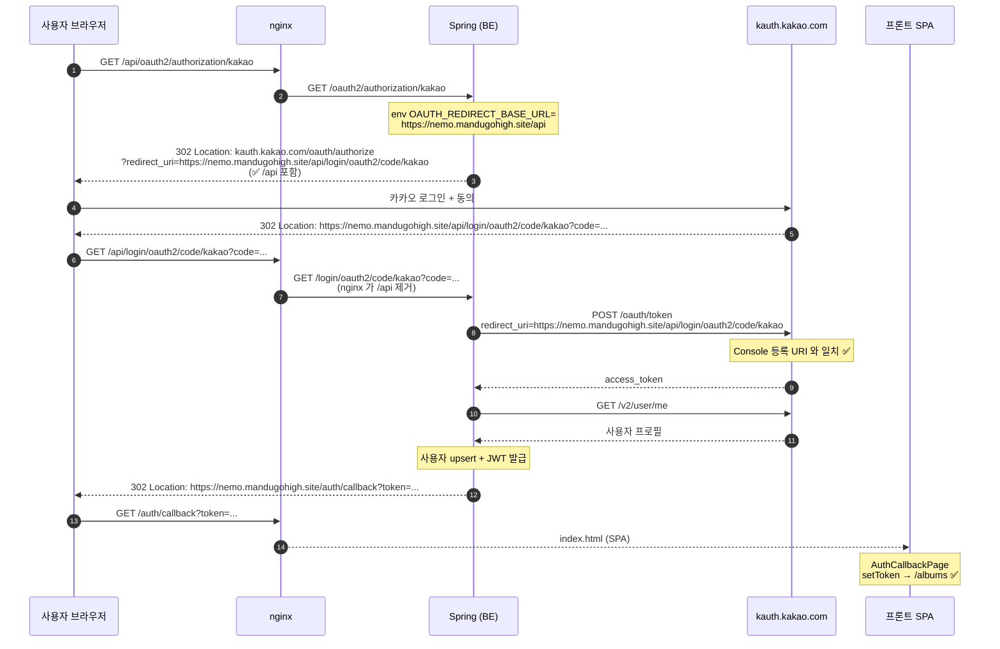

# 카카오 OAuth 로그인 시퀀스

배포 환경: nginx 가 `/api/` 를 백엔드로 프록시하고, 그 외는 SPA 로 서빙.

```nginx
location /api/ {
    proxy_pass http://127.0.0.1:8080/;   # ← trailing slash 가 /api prefix 를 떼고 백엔드로 전달
}
location / {
    root /release/home/nemo-fe/dist;
    try_files $uri $uri.html $uri/ /index.html;
}
```

## 수정 전 (버그)

`application.yml` 의 `redirect-uri: "{baseUrl}/login/oauth2/code/kakao"` 가 문제.
nginx 가 `/api` 를 떼고 백엔드로 보내기 때문에 백엔드는 자신의 base 가 `https://nemo.mandugohigh.site` (api 없음) 이라고 인식.
결과적으로 카카오에 보내는 redirect_uri 에 `/api` 가 빠져, 카카오 콜백이 SPA 로 떨어진다.



## 수정 후 (정상)

`application.yml` 의 `redirect-uri` 에 환경변수 `OAUTH_REDIRECT_BASE_URL` 도입.
prod 에서는 `https://nemo.mandugohigh.site/api` 로 주입 → 카카오에 보내는 redirect_uri 에 `/api` 가 포함된다.

```yaml
redirect-uri: "${OAUTH_REDIRECT_BASE_URL:http://localhost:8080}/login/oauth2/code/kakao"
```

```
# jenkinsController/services/nemo/be.env
OAUTH_REDIRECT_BASE_URL=https://nemo.mandugohigh.site/api
```



## 변경 파일

| 파일 | 변경 |
|---|---|
| `nemo-be/src/main/resources/application.yml` | kakao/google `redirect-uri` 의 `{baseUrl}` → `${OAUTH_REDIRECT_BASE_URL:http://localhost:8080}` |
| `jenkinsController/services/nemo/be.env` | `OAUTH_REDIRECT_BASE_URL=https://nemo.mandugohigh.site/api` 추가 |

## 카카오 Developer Console

등록된 Redirect URI: `https://nemo.mandugohigh.site/api/login/oauth2/code/kakao` 그대로 사용.
`https://nemo.mandugohigh.site/login/oauth2/code/kakao` (api 없는 것) 가 등록돼 있다면 이제 미사용이므로 정리 권장.
